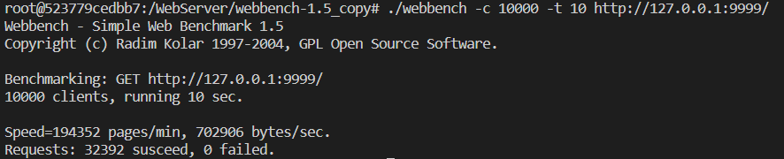

# 高性能 C++ Web 服务器

用 C++ 实现Linux上的高性能、高并发 Web 服务器，经过 Webbench 压力测试，可以实现上万的 QPS。

## 功能

- 使用Epoll边沿触发的IO多路复用技术，同步I/O模拟Proactor模式处理事件 。
- 多线程利用多核CPU实现高并发，并使用线程池避免线程频繁创建销毁的开销
- 利用正则与状态机解析 HTTP 请求报文，实现处理静态资源的请求。
- 基于双链表实现的定时器，自动关闭超时的非活动连接。
- 利用单例模式与阻塞队列实现异步的日志系统，记录服务器运行状态。
- webbenchh 压力测试可以实现 1w 的 QPS.

## 环境要求

- Linux
- C++14

## 目录树

```
.
|-- CMakeLists.txt
|-- build
|   |-- CMakeCache.txt
|   |-- Makefile
|   |-- cmake_install.cmake
|   `-- webserver
|-- Logger            日志类
|   |-- blockqueue.h
|   |-- buffer.cpp
|   |-- buffer.h
|   |-- log.cpp
|   `-- log.h
|-- http_conn.cpp
|-- http_conn.h
|-- locker.h
|-- lst_timer.h
|-- threadpool.h
|-- main.cpp
|-- resources          静态资源
|   |-- images
|   |   `-- image1.jpg
|   `-- index.html
`-- webbench-1.5       压力测试
|-- README.md
```

## 项目启动

```
cd build
make
./webserver 9999
```

## 

压力测试

```
cd webbench-1.5
./webbench -c 10000 -t 10 http://127.0.0.1:9999/
```



* 测试环境: Ubuntu:22.04 cpu:i5-8400 内存:16G
* QPS 10000+
